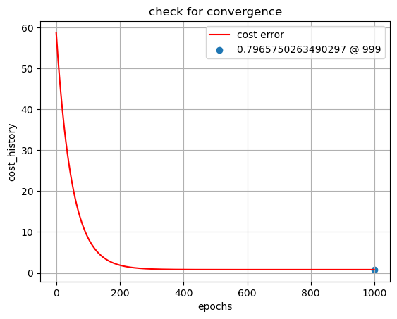
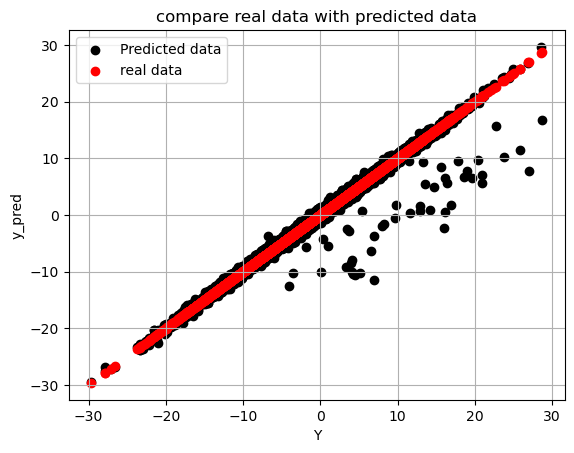

# Multiple Linear Regression - Gradient Descent (No Frameworks)

This project implements **Multiple Linear Regression** using **Gradient Descent** to optimize the model parameters (weights and bias). The model is built from scratch without relying on any machine learning frameworks, utilizing only **NumPy** and **Pandas** for computations and data handling.

---

## Key Features

- **Data Preprocessing**: The dataset is loaded, and the features are separated from the target variable.
- **Cost Function**: A custom cost function is used to compute the error between the predicted values and the actual data points.
- **Gradient Descent**: The model parameters (weights and bias) are iteratively updated using gradient descent to minimize the cost function.
- **Convergence Check**: The convergence of the model is tracked by plotting the cost error over epochs.
- **Prediction vs Real Data**: A comparison of the predicted values with the actual data is visualized through a scatter plot.

---

## Results

### 1. Convergence Plot
The **convergence plot** demonstrates how the cost error decreases over epochs, showing the model’s progress toward optimal parameter values. The plot highlights the minimum cost value.



### 2. Real vs Predicted Data
This plot compares the real data with the predicted data points, demonstrating how well the model performs.



---

## Files

- `code.py`: The main script for training the regression model using gradient descent and generating the plots.
- `ex_2.csv`: The dataset used for training the model.
- `convergence.png`: A plot showing the reduction of cost over epochs (convergence).
- `data_comparison.png`: A plot comparing the real vs predicted data points.

---

## How to Use

1. **Clone this repository**:
   ```bash
   git clone https://github.com/yourusername/your-repository-name.git
